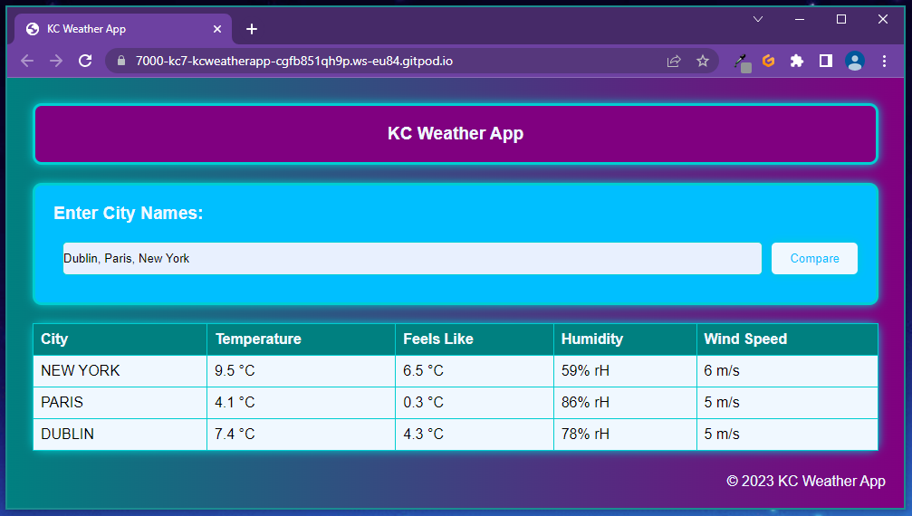

# [KC Weather App](https://kc-7.github.io/kc-weather-app/) 

## Introduction
KC Weather App is a web-based application that provides current weather information for multiple cities at a glance. You can enter the names of cities you want to compare and the application will retrieve the current weather information for each city, including temperature, feels like temperature, humidity and wind speed. This allows you to easily compare the weather of multiple cities without having to go to multiple websites.

## Features
- Enter multiple city names to compare their weather
- Displays temperature, feels like temperature, humidity and wind speed for each city
- User-friendly interface with a clean design
- Mobile responsive design
- Accurate weather information from OpenWeatherMap API

## Technologies used
- HTML
- CSS
- JavaScript

## User Interface
KC Weather App has a simple and intuitive user interface that makes it easy to use. The design is clean and modern, and the layout is optimized for both desktop and mobile devices. When you enter the names of cities you want to compare, the weather information for each city is displayed in a table, allowing you to quickly compare the weather in each city.

## User Experience
KC Weather App provides a seamless and hassle-free experience for its users. The application is designed with the user in mind, and all the information is presented in a clear and concise manner. The weather information is updated in real-time, ensuring that you have the most accurate information at your fingertips.

## Testing
KC Weather App has been thoroughly tested to ensure that it works correctly and provides accurate weather information. Some of the test cases include:

- Verifying that the application correctly retrieves the weather information for multiple cities
- Testing the responsiveness of the user interface on different screen sizes
- Verifying that the user interface is user-friendly and easy to use
- Testing the accuracy of the weather information against multiple sources
- Checking that the application functions correctly in different browsers and devices

## Conclusion
KC Weather App is a basic, user-friendly application that provides accurate and up-to-date weather information for multiple cities. Whether you're a traveler, weather enthusiast, or simply looking to compare the weather in different cities, KC Weather App is the perfect tool for you.

## Credits
I utilised the information I learned from the Code Institute alongside ChatGPT requests to create and customise this project. 

