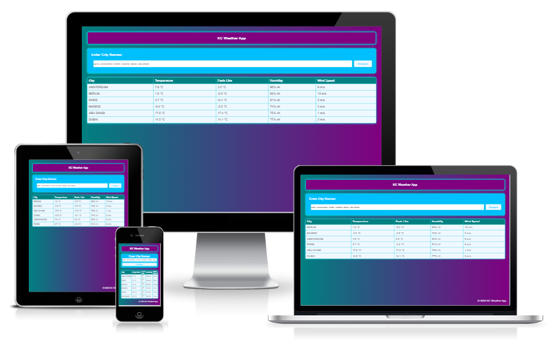

# [KC Weather App](https://kc-7.github.io/kc-weather-app/) 

## Introduction 🌡
KC Weather App is a web-based platform that presents the current weather of several cities in one glance. Simply type in the city names you desire to compare and the application will fetch and showcase the current weather information for each city. Information such as temperature, perceived temperature, humidity, and wind speed can be viewed.

## Features to Explore ⛅
- The capability to compare weather in multiple cities
- Display of temperature, perceived temperature, humidity, and wind speed for each city
- A user-friendly interface with an aesthetic design
- Mobile compatibility for on-the-go usage
- Utilization of OpenWeatherMap API for accurate weather information

## Technologies Used ☀
- HTML
- CSS
- JavaScript

## UI and Design 🌫
KC Weather App boasts a user interface that is both simple and intuitive, making it a breeze to navigate. The design is contemporary with a clean appearance and optimized for both desktop and mobile usage. The cities' weather information is presented in a table format for effortless comparison.

## User Experience ☁
KC Weather App provides a smooth and effortless experience for its users. The application is designed keeping the user in mind, presenting information in a clear and succinct manner. The weather information is updated in real-time to ensure users have access to the most accurate information at all times.

## Testing ☔
To ensure the functionality and accuracy of KC Weather App, a variety of tests have been conducted, including:

- Verification of the application's ability to retrieve weather information for multiple cities
- Testing the responsiveness of the user interface on various screen sizes
- User-friendliness verification of the user interface
- Testing the accuracy of the weather information using multiple sources
- Checking the application's compatibility across different browsers and devices

## Conclusion ☂
KC Weather App is a basic and user-friendly platform that provides current and accurate weather information for several cities. Whether you are a traveler, weather aficionado, or just curious about the weather in different cities, KC Weather App is the ideal tool for you.

## Credits ⛈
- This project was created and customized using information obtained from the Code Institute and ChatGPT inquiries.
- This project uses Open Weather Map API to import current weather data.

